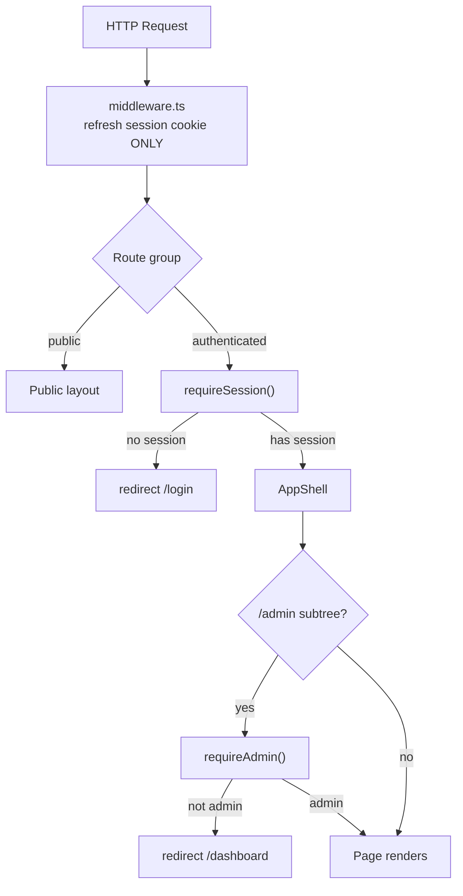
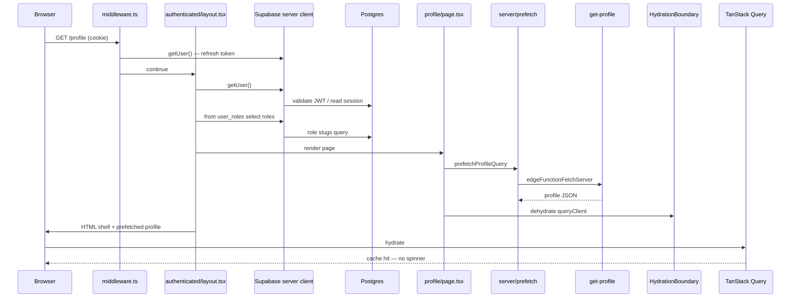
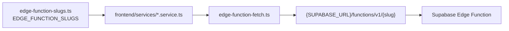
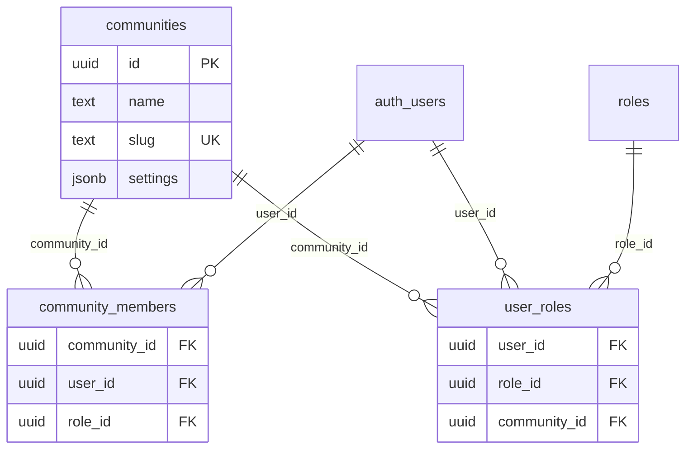

# GoverNerds — Architecture FAQ

> **Companion to:** [`ARCHITECTURE.md`](ARCHITECTURE.md)  
> **Audience:** Engineers onboarding to the codebase who want deeper answers to common "why?" questions.

---

## Table of contents

1. [SSR bootstrap and shells](#1-ssr-bootstrap-and-shells)
2. [Slugs registry and "magic URLs"](#2-slugs-registry-and-magic-urls)
3. [Why the `communities` table exists](#3-why-the-communities-table-exists)

---

## 1. SSR bootstrap and shells

### The one-line version

When a layout needs to know **who is signed in** and **what coarse roles they hold** before rendering HTML, it reads that data directly from Postgres via the Supabase server client — instead of calling an Edge Function. That is the **SSR bootstrap** path, and it is the **only** intentional exception to "all domain data goes through Edge Functions."

### Three data paths (where SSR fits)

From [ARCHITECTURE.md §3](ARCHITECTURE.md#3-system-overview), the platform has three ways data moves:

| Path | When | Flow |
|------|------|------|
| **Client reads/writes** | User clicks, submits a form | Component → TanStack Query → `frontend/services` → Edge Function → Postgres |
| **SSR bootstrap** | Layout needs session/roles | `server/loaders` → Supabase server client → Postgres (**auth exception only**) |
| **Background jobs** | Side effects after an event | `events.publish()` → Inngest → handler → provider/DB |

```mermaid
flowchart TB
    subgraph clientPath [Client path — all domain data]
        C[Component]
        TQ[TanStack Query]
        FS[frontend/services]
        EF[Edge Function]
        PG1[(Postgres)]
        C --> TQ --> FS --> EF --> PG1
    end

    subgraph ssrPath [SSR bootstrap — auth gating only]
        L[server/loaders]
        SC[Supabase server client]
        PG2[(Postgres)]
        L --> SC --> PG2
    end

    subgraph jobPath [Background jobs]
        PUB[publishEvent]
        ING[Inngest]
        JF[job function]
        PG3[(Postgres)]
        PUB --> ING --> JF --> PG3
    end
```



**SSR auth bootstrap is NOT used for:** profile data, feature flags, permission lists, or any mutation. Domain data goes through Edge Functions — prefetched on the server for feature pages (`page.tsx` → `server/prefetch` → `PrefetchBoundary`), then read via TanStack hooks on the client.

### Why it is called an "auth exception"

The hard rule (see [ARCHITECTURE.md §4](ARCHITECTURE.md#4-hard-architectural-rules)) is:

> **No PostgREST in frontend** — no `.from("table")`. Table access lives in `_models/` only.

SSR loaders break that rule **intentionally and narrowly** in `src/server/loaders/session.ts`:

```29:32:src/server/loaders/session.ts
  const { data } = await supabase
    .from("user_roles")
    .select("roles(slug)")
    .eq("user_id", user.id);
```

**Why not use an Edge Function here?** Every authenticated page needs session + role slugs at layout time — before any HTML is sent. Routing through `get-permissions` would add an HTTP round-trip on **every** SSR page load, just to answer "is this person signed in?" and "are they an admin?" That is slow, redundant (middleware already touched auth), and unrelated to domain business logic.

The comment in the loader makes the intent explicit:

```13:19:src/server/loaders/session.ts
/**
 * Reads the current session and the user's role slugs for SSR. Used by route
 * group layouts to gate access. Returns `null` when there is no session.
 *
 * Reading the session and roles directly via the Supabase server client (rather
 * than over HTTP) is the documented SSR exception: it avoids a round-trip for
 * the auth bootstrap that every authenticated page needs.
 */
```

**What the server client does:** `createServerSupabaseClient()` binds to the request cookies, uses the anon key plus the caller's JWT, and therefore **RLS still applies**. This is not a service-role bypass.

### How SSR shells work — the full lifecycle

Auth gating lives in **route-group layouts**, not in middleware and not on every page. Middleware has one job: refresh the session cookie.



#### Shell inventory

| Route group | Layout file | Gate | Shell |
|-------------|-------------|------|-------|
| `(public)` | [`src/app/(public)/layout.tsx`](src/app/(public)/layout.tsx) | None at layout level; auth pages call `redirectIfAuthenticated()` | Marketing header + footer |
| `(authenticated)` | [`src/app/(authenticated)/layout.tsx`](src/app/(authenticated)/layout.tsx) | `requireSession()` | [`AppShell`](src/app/(authenticated)/components/AppShell.tsx) |
| `(authenticated)/admin/` | [`src/app/(authenticated)/admin/layout.tsx`](src/app/(authenticated)/admin/layout.tsx) | `requireAdmin()` | Inherits `AppShell` from parent |
| `(member)` | [`src/app/(member)/layout.tsx`](src/app/(member)/layout.tsx) | `requireSession()` (stub) | None yet — reserved for community member shell |
| `(shared)` | [`src/app/(shared)/layout.tsx`](src/app/(shared)/layout.tsx) | None | Minimal header (help, legal, etc.) |

Parentheses in route group names are **not URL segments**. `(authenticated)/dashboard/page.tsx` renders at `/dashboard`, not `/(authenticated)/dashboard`.

#### Walkthrough: request to `/profile`

1. **Browser** sends GET `/profile` with session cookie.

2. **`middleware.ts`** runs on every matched route. It calls `updateSession()`, which touches `supabase.auth.getUser()` to refresh the token if needed. No redirects, no role checks.

   ```36:37:src/lib/supabase/middleware.ts
     // Touch the user to trigger token refresh when needed. Do not add logic here.
     await supabase.auth.getUser();
   ```

3. **Next.js** resolves the route to `(authenticated)/profile/page.tsx`. The `(authenticated)/layout.tsx` runs first (layouts wrap pages).

4. **`requireSession()`** in the authenticated layout:
   - Creates a server Supabase client from cookies
   - Calls `auth.getUser()` — if no user, `redirect("/login")`
   - Queries `user_roles` joined to `roles` for role slugs
   - Returns `{ user, roleSlugs }`

5. **Layout computes `isAdmin`** from role slugs and renders `AppShell` with `email` and `isAdmin` props. The shell is purely presentational — nav links, sign-out button, content area. It does **not** fetch profile data.

6. **`profile/page.tsx`** prefetches profile data on the server via `PrefetchBoundary` → `server/prefetch/profile.ts` → `edgeFunctionFetchServer` → `get-profile` Edge Function. The dehydrated TanStack cache is embedded in HTML.

7. **Client hydration:** `<Profile />` calls `useProfileQuery()`, which reads the warm cache immediately — no loading spinner on first paint. Mutations, Realtime, and client navigations still use the normal client path.



#### Walkthrough: request to `/admin/flags` (nested gate)

Same as above through step 5, then:

6. **`admin/layout.tsx`** runs. It calls `requireAdmin()`, which calls `requireSession()` again, checks for `admin` or `super_admin` in role slugs, and redirects non-admins to `/dashboard`.

7. Admin page renders inside the same `AppShell` (parent layout already rendered it).

**Important distinction:** UI gates (layout redirects) are **coarse**. They hide nav links and block page access. **Fine-grained authorization** still happens in Edge Functions via `withAuth`, `withPermission`, `withAccessContext`, etc. Never trust the UI alone for mutations.

### What is already good

- **Gating in layouts, not middleware** — middleware stays fast and single-purpose; layouts own auth decisions per route group.
- **Coarse UI gates vs fine-grained Edge authorization** — layouts redirect; Edge Functions enforce permissions on every write.
- **Thin pages with server prefetch** — `page.tsx` prefetches route queries; feature components stay client-side for interactivity.
- **Shell receives minimal server data** — layout only passes `email` and `isAdmin` for nav; domain data prefetches at the page level.

### Potential improvements

| Priority | Issue | Evidence | Proposed fix |
|----------|-------|----------|--------------|
| **High** | Duplicate session fetch on nested layouts | `requireAdmin()` calls `requireSession()` after the parent `(authenticated)` layout already did; no `React.cache()` in the repo | Wrap `getSessionContext` in `cache()` from `react` so one request deduplicates to a single DB round-trip |
| **Medium** | `ADMIN_ROLES` duplicated | Defined in both [`src/app/(authenticated)/layout.tsx`](src/app/(authenticated)/layout.tsx) and [`src/server/loaders/access.ts`](src/server/loaders/access.ts) | Extract to a shared helper, e.g. `isAdminRole(roleSlugs)` exported from `access.ts` |
| **Medium** | Admin nav vs admin gate logic split | Layout computes `isAdmin` for nav; `requireAdmin` recomputes the same check for the gate | Same `isAdminRole()` helper used by both layout and loader |
| **Low** | Public/shared layout duplication | Similar header markup in `(public)` and `(shared)` layouts | Optional shared `MarketingHeader` component when `(shared)` grows beyond a stub |
| **Low** | Member group stub | `(member)/layout.tsx` calls `requireSession()` but has no distinct shell yet | Defer until community/member UX is defined; intended for community-scoped member experiences separate from the main product shell |
| **Future** | Community context in SSR | When communities UI ships, layouts will need active `community_id` from URL or cookie | Add `getCommunityContext()` loader; community-scoped RLS and `user_roles.community_id` are already stubbed in the schema |

**Example of the highest-priority fix** (not implemented yet — documentation only):

```typescript
import { cache } from "react";

export const getSessionContext = cache(async (): Promise<SessionContext | null> => {
  // existing implementation
});
```

With `cache()`, when `(authenticated)/layout.tsx` and `admin/layout.tsx` both call `requireSession()` in the same request, Next.js executes the loader body once and reuses the result.

---

## 2. Slugs registry and "magic URLs"

### What is a "magic URL"?

A **magic URL** is a hardcoded endpoint string scattered at call sites — easy to typo, impossible to grep centrally, and unsafe to rename.

```typescript
// BAD — magic URL (hardcoded path fragment)
fetch(`${process.env.NEXT_PUBLIC_SUPABASE_URL}/functions/v1/get-profile`);

// BAD — untyped string literal (no compile-time check)
edgeFunctionFetch("get-profile");

// BAD — duplicated URL construction in every service
const url = `${SUPABASE_URL}/functions/v1/${someString}`;
```

These strings are "magic" because their meaning lives only at the call site. If you rename `get-profile` to `fetch-my-profile`, you must find every string by hand. TypeScript will not help.

### The correct pattern: slug registry

All Edge Function slugs live in one registry:

```10:16:src/config/edge-function-slugs.ts
export const EDGE_FUNCTION_SLUGS = {
  getHealth: "get-health",
  getProfile: "get-profile",
  updateProfile: "update-profile",
  getPermissions: "get-permissions",
  getFeatureFlag: "get-feature-flag",
} as const;
```

Frontend services import from the registry:

```typescript
// GOOD — registry + typed slug
import { EDGE_FUNCTION_SLUGS } from "@/config/edge-function-slugs";
import { edgeFunctionFetch } from "@/lib/edge-function-fetch";

export function getProfile() {
  return edgeFunctionFetch<ProfileResponse>(EDGE_FUNCTION_SLUGS.getProfile);
}
```

URL construction is centralized in one place:

```44:46:src/lib/edge-function-fetch.ts
  const url = new URL(
    `${clientEnv.NEXT_PUBLIC_SUPABASE_URL}/functions/v1/${slug}`,
  );
```

The `slug` parameter is typed as `EdgeFunctionSlug` — a union of all registry values — so a typo like `"get-my-profil"` fails at compile time.



### Why the registry matters

1. **Rename safety** — changing a slug means updating the registry, the function folder name, and `supabase/config.toml` together. The registry comment documents this contract:

   ```1:5:src/config/edge-function-slugs.ts
   /**
    * Single registry of Supabase Edge Function slugs. Every frontend service and
    * SSR loader references slugs from here — never hardcoded URL strings. Renaming
    * a slug means changing it here, the function folder, and `config.toml`
    * together.
   ```

2. **TypeScript enforcement** — `EdgeFunctionSlug` prevents passing arbitrary strings to `edgeFunctionFetch`.

3. **Grep-ability** — one file lists every API door the frontend knows about. Searching `EDGE_FUNCTION_SLUGS` tells you the full client-facing surface area.

### Naming convention (1:1 across layers)

| Layer | Example |
|-------|---------|
| Edge Function slug | `update-profile` |
| Registry key | `updateProfile` |
| Service function | `updateProfile()` |
| Mutation hook | `useUpdateProfileMutation()` |
| Function folder | `supabase/functions/update-profile/` |

Slugs use **verb-kebab-noun** (`get-profile`, not `profile-get` or `myProfile`).

### Rename checklist example

To rename `get-profile` → `fetch-my-profile`:

| # | File | Change |
|---|------|--------|
| 1 | `src/config/edge-function-slugs.ts` | `getProfile: "fetch-my-profile"` |
| 2 | `supabase/functions/get-profile/` | Rename folder to `fetch-my-profile/` |
| 3 | `supabase/config.toml` | Update function entry name |
| 4 | `src/frontend/services/profile.service.ts` | No change if registry **key** stays `getProfile` |

If you also rename the registry key (e.g. `getProfile` → `fetchMyProfile`), update every import — but the URL string itself still comes from the registry, never inline.

---

## 3. Why the `communities` table exists

### Direct answer

The job description never says "communities" as a table name either. The table was included as **forward-looking infrastructure** — a low-cost stub for multi-space tenancy that several JD requirements imply (Reddit-style boards, membership gating, scoped moderation).

The migration comment states the intent:

```21:21:supabase/migrations/20260101000100_identity.sql
-- Communities (stub for future multi-tenant features).
```

[ARCHITECTURE.md §16](ARCHITECTURE.md#16-what-is-not-built-yet) lists forums, moderation, and payments under intentionally deferred work. **Communities read UI** (list + home placeholder, nav link, `list-communities` / `get-community`) is in early delivery; community CRUD, join/leave, forums, and switcher are not.

### What exists in the database today

| Artifact | Purpose |
|----------|---------|
| `communities` table | Named space (name, slug, settings JSON) |
| `community_members` table | Links users to communities with a role |
| `user_roles.community_id` | Roles can be scoped to a specific community |
| `roles.scope` enum (`system` \| `community`) | Distinguishes global vs community-local roles |
| RLS policy `communities_select_member` | Members can read communities they belong to |
| Seed row `GoverNerds HQ` | Sample community for local dev |



### Job description → schema mapping

| Job description requirement | How `communities` supports it (future) |
|------------------------------|------------------------------------------|
| Reddit-style message board with moderation | Scoped communities (like subreddits) with community-level moderators |
| Permissions for community members and admins | `user_roles.community_id` allows community-scoped role assignments |
| Gated video / membership content | Community = membership boundary for access control |
| Editorial publishing layer | Community-owned content spaces with staff roles per community |
| CMS for non-technical staff | Community = tenant boundary for content teams |
| Community safety / trust & safety | Moderation scope per community, not just globally |

None of these features are built yet. The table ensures we do not need a painful migration when they arrive.

### Built now vs built later

```mermaid
flowchart LR
    subgraph now [Built now]
        T[communities table]
        M[community_members table]
        R[community-scoped user_roles FK]
        RS[role_scope enum]
        S[Seed community: GoverNerds HQ]
        RLS[RLS policies]
        UI[List and home UI]
        NAV[Communities nav in AppShell]
        EF[list-communities and get-community]
    end

    subgraph later [Not built yet — product]
        SW[Community switcher / active context]
        CRUD[Community create and admin UI]
        JOIN[Join and leave flows]
        FORUM[Community-scoped forums]
        GATE[Gated content per community]
        MOD[Community-level moderation tools]
    end

    now --> later
```



The `(member)` route group layout is a related stub — reserved for signed-in users who get a **distinct shell** from primary users (e.g. community members viewing gated content):

```5:8:src/app/(member)/layout.tsx
/**
 * Member group layout (Phase 1 stub). Reserved for signed-in users who get a
 * distinct shell from primary users (e.g. community members). For now it
 * simply requires a session; its own shell and role redirect arrive later.
```

### Honest framing

If the product ends up as a **single global community** with no sub-communities, the communities layer could be simplified or removed. That would be a deliberate product decision, not a technical accident.

However, the JD describes:

- A **Reddit-style** board (inherently multi-community)
- **Membership-gated** video content
- **Moderation tools** (typically scoped per community)
- Experience with **community platforms** and **membership sites**

Multi-space tenancy is a reasonable default assumption. The stub tables cost almost nothing now and prevent a schema rewrite later.

### What you will NOT find yet

- No community create/admin UI or join/leave flows
- No community switcher or active-community context in layouts
- No community-scoped forums, gated content, or moderation tools
- No Edge Functions for community CRUD mutations (read path only: `list-communities`, `get-community`)
- No cookie- or session-backed community context loader (`getCommunityContext()` is still future work); read prefetch via `prefetchCommunitiesQuery` / `prefetchCommunityQuery` is in place

When the next community features ship, expect the [new feature checklist](ARCHITECTURE.md#17-new-feature-checklist) pattern: migration (if needed) → model → DTO → service → Edge Function slug → frontend service → hooks → UI.

---

## Further reading

- [ARCHITECTURE.md §3 — System overview](ARCHITECTURE.md#3-system-overview) — three data paths
- [ARCHITECTURE.md §4 — Hard architectural rules](ARCHITECTURE.md#4-hard-architectural-rules) — slug registry rule
- [ARCHITECTURE.md §8 — Authentication & authorization](ARCHITECTURE.md#8-authentication--authorization) — auth flow sequence diagram
- [ARCHITECTURE.md §11 — Route groups & gating](ARCHITECTURE.md#11-route-groups--gating) — layout responsibilities
- [ARCHITECTURE.md §16 — What is NOT built yet](ARCHITECTURE.md#16-what-is-not-built-yet) — deferred features including forums and moderation
