# GoverNerds — Architecture & Onboarding Guide

> **Snapshot date:** June 2026  
> **Phase:** Platform foundation (no product features yet)  
> **Audience:** New engineers joining the project

This document is a snapshot of where the codebase is today: what is built, how the pieces connect, and the conventions you must follow when adding features.

---

## Table of contents

1. [What this project is](#1-what-this-project-is)
2. [Tech stack](#2-tech-stack)
3. [System overview](#3-system-overview)
4. [Hard architectural rules](#4-hard-architectural-rules)
5. [Frontend architecture](#5-frontend-architecture)
6. [Backend architecture (Edge Functions)](#6-backend-architecture-edge-functions)
7. [Database & RLS](#7-database--rls)
8. [Authentication & authorization](#8-authentication--authorization)
9. [Event-driven architecture](#9-event-driven-architecture)
10. [Swappable providers](#10-swappable-providers)
11. [Route groups & gating](#11-route-groups--gating)
12. [Error handling](#12-error-handling)
13. [Testing & CI](#13-testing--ci)
14. [Local development](#14-local-development)
15. [Deployment](#15-deployment)
16. [What is NOT built yet](#16-what-is-not-built-yet)
17. [New feature checklist](#17-new-feature-checklist)

---

## 1. What this project is

GoverNerds is a community platform. **This repo ships the foundation only** — the infrastructure every future feature will sit on:

| Built | Not built yet |
|-------|---------------|
| Auth (email, OAuth, magic link) | Forums, comments, voting |
| Role-based access control | Moderation, memberships |
| Feature flags | Payments, video, CMS |
| Background jobs (Inngest) | Notifications, DMs |
| Email (Resend) | Communities UI |
| Search indexing stub | Product analytics |

The goal: add product features **without re-architecting**. Every layer has a fixed place and naming convention.

### One-line mental model

```
Slugs = HTTP doors · Services = use cases · Models = tables · DTOs = contracts
```

---

## 2. Tech stack

| Layer | Technology | Purpose |
|-------|-----------|---------|
| **Frontend** | Next.js 16 (App Router), React 19, TypeScript | UI, SSR layouts |
| **Styling** | Tailwind CSS 4, shadcn/ui | Components |
| **Client state** | TanStack Query v5 (server data), Jotai (ephemeral UI only) | Data fetching, modals |
| **Forms** | React Hook Form + Zod | Validation |
| **Backend API** | Supabase Edge Functions (Deno) | All domain reads/writes |
| **Database** | Supabase Postgres | Primary data store |
| **Auth** | Supabase Auth | Sessions, OAuth, magic links |
| **Cache / rate limit** | Upstash Redis | Rate limiting, token cache |
| **Jobs** | Inngest | Async side effects |
| **Email** | Resend + React Email | Transactional email |
| **Analytics** | PostHog (optional) | Event tracking |
| **Monitoring** | Sentry | Error reporting |
| **Testing** | Vitest (unit), Playwright (e2e + a11y) | Quality gates |
| **Deploy** | Vercel (app), Supabase CLI (functions) | CI/CD |

---

## 3. System overview

### High-level architecture

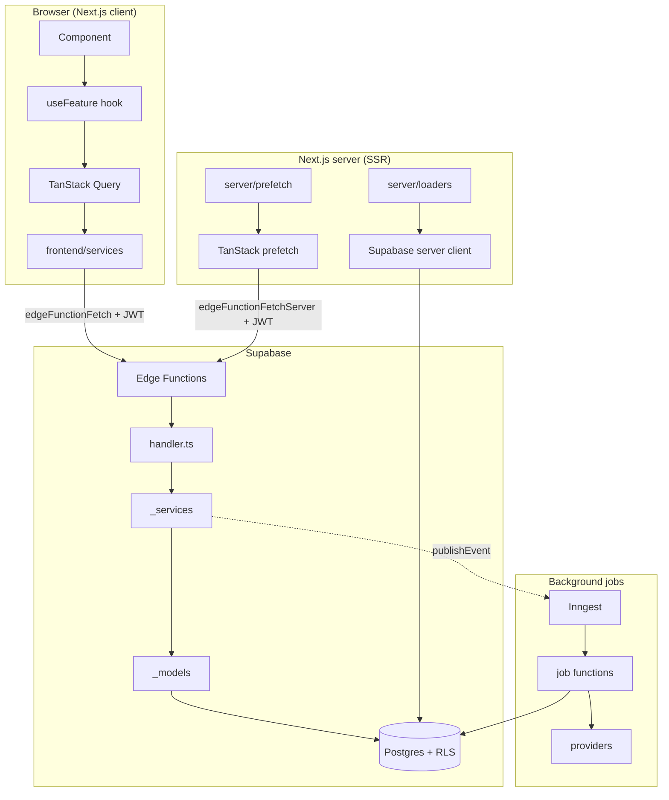

### Data paths

| Path | When | Flow |
|------|------|------|
| **Client reads/writes** | User clicks, submits a form, client navigation | Component → TanStack → service → Edge Function → Postgres |
| **SSR auth bootstrap** | Layout needs session/roles | `server/loaders` → Supabase server client → Postgres (auth exception only) |
| **SSR page prefetch** | Feature page needs initial domain data | `page.tsx` → `server/prefetch` → `edgeFunctionFetchServer` → Edge Function → `PrefetchBoundary` → client hooks |
| **Background jobs** | Side effects after an event | `events.publish()` / `publishEvent()` → Inngest → handler → provider/DB |

### Allowed Next.js route handlers (only two)

| Route | Purpose |
|-------|---------|
| `src/app/auth/callback/route.ts` | OAuth / magic-link PKCE exchange |
| `src/app/api/inngest/route.ts` | Inngest webhook (jobs platform requirement) |

Everything else goes through Edge Functions.

---

## 4. Hard architectural rules

These are **non-negotiable**. ESLint and `AGENTS.md` enforce them.

| Rule | Why |
|------|-----|
| **No Server Actions** (`"use server"`) | Keeps all domain logic in Edge Functions |
| **No domain `/api` routes** | Edge Functions are the API |
| **No PostgREST in frontend** (no `.from("table")`) | Table access lives in `_models/` only |
| **TanStack Query for server state** | Never put domain data in Jotai |
| **Jotai for ephemeral UI only** | Open/closed, active step — not profiles, flags, etc. |
| **Never show raw errors to users** | Plain language for a 35–70 audience |
| **Slugs from registry only** | `src/config/edge-function-slugs.ts` — no magic URLs |

---

## 5. Frontend architecture

### Layer diagram

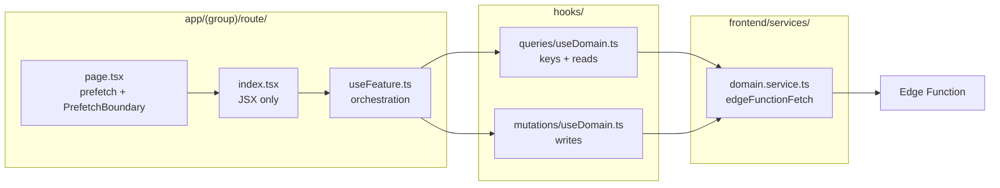

### Naming convention (1:1 across layers)

| Layer | Example |
|-------|---------|
| Edge Function slug | `update-profile` |
| Service function | `updateProfile()` |
| Query hook | `useProfileQuery()` |
| Mutation hook | `useUpdateProfileMutation()` |
| Query key | `["profile", "me"]` |
| Colocated UI hook | `useProfile()` |

### Directory map

```
src/
├── app/
│   ├── (public)/          login, signup, forgot/reset password, landing
│   ├── (authenticated)/   dashboard, profile, admin (nested role gate)
│   ├── (member)/          stub layout for future member shell
│   ├── (shared)/          help page (any auth state)
│   ├── auth/callback/     OAuth bridge (exception)
│   └── api/inngest/       jobs webhook (exception)
├── components/            shared UI + ui/ (shadcn)
├── hosts/                 global toasts/modals (mounted once)
├── hooks/
│   ├── queries/           reads + *.keys.ts + invalidation helpers
│   └── mutations/         writes (imports keys from query file)
├── frontend/services/     HTTP adapters (edgeFunctionFetch + slugs)
├── server/
│   ├── loaders/           SSR session/role bootstrap (auth exception)
│   └── prefetch/          SSR TanStack prefetch helpers (server-only)
├── lib/
│   ├── query/             getQueryClient, PrefetchBoundary
│   └── edge-function/     shared request + client/server fetchers
└── config/                edge-function-slugs registry
```

### Worked example: updating a profile

**Step 1 — Page (prefetch + hydrate)**

```tsx
// src/app/(authenticated)/profile/page.tsx
import { PrefetchBoundary } from "@/lib/query/prefetch-boundary";
import { prefetchProfileQuery } from "@/server/prefetch/profile";

import { Profile } from "./components/Profile";

export default async function ProfilePage() {
  return (
    <PrefetchBoundary prefetch={prefetchProfileQuery}>
      <Profile />
    </PrefetchBoundary>
  );
}
```

The prefetch helper lives in `server/prefetch/profile.ts` and calls the same
Edge Function slug as the client service, via `edgeFunctionFetchServer`. Query
keys come from `hooks/queries/profile.keys.ts` (server-safe, no browser deps).

**Step 2 — Component (JSX only)**

```tsx
// src/app/(authenticated)/profile/components/Profile/index.tsx
"use client";
import { useProfile } from "./useProfile";

export function Profile() {
  const { form, onSubmit, isLoading } = useProfile();
  // ... render form fields, call onSubmit
}
```

**Step 3 — Colocated hook (orchestration: form, toasts, routing)**

```tsx
// useProfile.ts — wires React Hook Form + mutation + toasts
const mutation = useUpdateProfileMutation();
async function onSubmit(values) {
  await mutation.mutateAsync(values);
  toast.success("Profile updated.");
}
```

**Step 4 — TanStack mutation**

```tsx
// src/hooks/mutations/useProfile.ts
export function useUpdateProfileMutation() {
  const queryClient = useQueryClient();
  return useMutation({
    mutationFn: updateProfile,          // from frontend/services
    onSuccess: () => invalidateProfileQueries(queryClient),
  });
}
```

**Step 5 — Frontend service**

```tsx
// src/frontend/services/profile.service.ts
export function updateProfile(body: UpdateProfileBody) {
  return edgeFunctionFetch<ProfileResponse, UpdateProfileBody>(
    EDGE_FUNCTION_SLUGS.updateProfile,
    { method: "PATCH", body },
  );
}
```

**Step 6 — `edgeFunctionFetch` attaches the session JWT**

```tsx
// src/lib/edge-function-fetch.ts
const url = `${SUPABASE_URL}/functions/v1/${slug}`;
fetch(url, {
  headers: {
    Authorization: `Bearer ${session.access_token}`,
    apikey: ANON_KEY,
  },
  body: JSON.stringify(body),
});
```

> **Rule:** Components never call `edgeFunctionFetch` directly. They go through TanStack hooks → services.

### Auth forms (exception to Edge Function flow)

Login, signup, and password reset use **Supabase Auth directly** via `src/lib/auth/client.ts` — not Edge Functions. Auth is a platform concern, not a domain API.

```tsx
// src/app/(public)/login/components/LoginForm/useLoginForm.ts
await signInWithPassword(values.email, values.password);
router.push("/dashboard");
```

---

## 6. Backend architecture (Edge Functions)

### Layer diagram

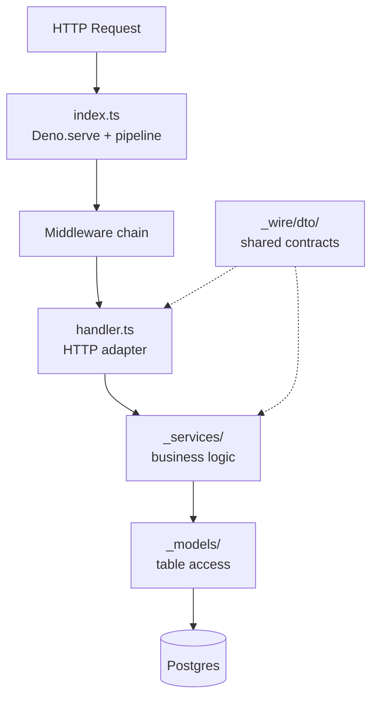

### Directory map

```
supabase/functions/
├── get-profile/          one folder per slug
│   ├── index.ts             Deno.serve + middleware assembly
│   └── handler.ts           HTTP adapter only
├── update-profile/
├── get-permissions/
├── get-feature-flag/
├── get-health/
├── _models/                 one file per table — ALL .from() here
├── _services/               business logic + pure evaluators
│   ├── user/
│   ├── access-control/
│   └── feature-flag/
└── _wire/
    ├── dto/                 shared wire types (@shared/dto/*)
    ├── middleware/          pipeline, auth, rate limit, access control
    ├── context.ts           HandlerContext type
    └── response.ts          standardized JSON responses
```

### Middleware pipeline

Each Edge Function assembles its own pipeline in `index.ts`. Middleware runs **outermost first** (left to right in the array):

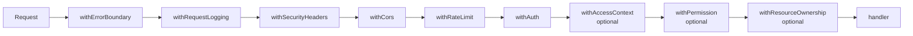

**Example — `update-profile/index.ts`:**

```typescript
import { serveAuthenticated } from "@shared/middleware/index.ts";
import { handle } from "./handler.ts";

serveAuthenticated(handle, {
  name: "update-profile",
  limit: 20,
  windowSeconds: 60,
});
```

Presets live in `_wire/middleware/presets.ts`: `servePublic`, `serveOptionalAuth`,
`serveAuthenticated`, `serveWithAccessContext`, `serveWithPermission`.

### Handler responsibilities

| Do | Don't |
|----|-------|
| Check HTTP method | Query `.from("table")` |
| Parse + validate body (Zod) | Business rules |
| Return `apiResponse.ok/error` | Cross-table orchestration |

**Example — `update-profile/handler.ts`:**

```typescript
export async function handle(ctx: HandlerContext): Promise<Response> {
  if (ctx.req.method !== "PATCH") return apiResponse.error(405, ...);
  if (!ctx.user) return apiResponse.unauthorized();

  const parsed = bodySchema.safeParse(await ctx.req.json());
  if (!parsed.success) return apiResponse.badRequest(...);

  const profile = await updateProfile(ctx.userClient!, ctx.user.id, parsed.data);
  return apiResponse.ok(profile);
}
```

### Service responsibilities

| Do | Don't |
|----|-------|
| Validation, authorization | HTTP concerns |
| Multi-step workflows | Direct `.from()` calls |
| Map DB rows → DTOs | Import from handlers |

**Example — `_services/user/profile.service.ts`:**

```typescript
export async function updateProfile(client, userId, body) {
  const patch = { display_name: body.displayName, ... };
  const row = await updateProfileByOwnerId(client, userId, patch);
  return toResponse(row);  // snake_case → camelCase
}
```

### Model responsibilities

| Do | Don't |
|----|-------|
| ALL `.from("profiles")` for that table | Cross-table joins/orchestration |
| Return typed rows | Business logic |

**Example — `_models/profiles.ts`:**

```typescript
export async function updateProfileByOwnerId(client, ownerId, patch) {
  const { data, error } = await client
    .from("profiles")
    .update(patch)
    .eq("owner_id", ownerId)
    .select(COLUMNS)
    .single();
  if (error) throw new Error(error.message);
  return data;
}
```

### DB clients

| Client | Key | RLS | When to use |
|--------|-----|-----|-------------|
| **User client** | Anon + caller JWT | ✅ Applies | Default for user data |
| **Service client** | Service role | ❌ Bypasses | Only after explicit auth check in code |

### Current Edge Function registry

| Slug | Method | Auth | Purpose |
|------|--------|------|---------|
| `get-health` | GET | Optional | Health check |
| `get-profile` | GET | Required | Current user's profile |
| `update-profile` | PATCH | Required | Update own profile |
| `get-permissions` | GET | Required | Effective permissions list |
| `get-feature-flag` | GET | Optional | Evaluate a feature flag |

All slugs are registered in:
- `src/config/edge-function-slugs.ts` (frontend)
- `supabase/config.toml` (per-function config)

---

## 7. Database & RLS

### Migration order

| File | Contents |
|------|----------|
| `20260101000000_init.sql` | Extensions, `set_updated_at()` trigger |
| `20260101000100_identity.sql` | `profiles`, `communities`, `community_members` |
| `20260101000200_access_control.sql` | `roles`, `permissions`, `role_permissions`, `user_roles` |
| `20260101000300_platform.sql` | `audit_logs`, `feature_flags`, `feature_flag_targets`, `analytics_events` |
| `20260101000400_search.sql` | `search_documents` |
| `20260101000500_new_user_trigger.sql` | Auto-create profile + assign `member` role on signup |
| `20260101000600_rls.sql` | Row Level Security policies on every table |

Migrations use strictly increasing timestamps: `YYYYMMDDHHMMSS_snake_case.sql`.
Each up migration in `supabase/migrations/` must have a paired rollback file in
`supabase/rollback/` with the same timestamp prefix. Apply rollbacks locally with
`npm run db:rollback` (never auto-run on `db reset`).

### Entity relationship (simplified)

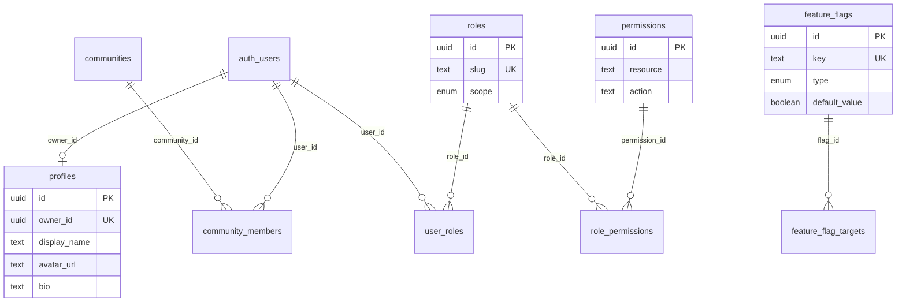

### RLS strategy

RLS is **defense in depth**. The service layer is primary authority; RLS ensures the user-scoped client can never touch rows it shouldn't.

| Table | Policy |
|-------|--------|
| `profiles` | User reads/updates **own row only** (`owner_id = auth.uid()`) |
| `user_roles` | User reads **own assignments** |
| `roles`, `permissions`, `role_permissions` | Any authenticated user (reference data) |
| `feature_flags` | Any authenticated user |
| `search_documents` | Any authenticated user (writes via service client) |
| `communities` | Members of that community |
| `audit_logs`, `analytics_events`, `feature_flag_targets` | **No user policies** — service client only |

### New user trigger

When someone signs up, Postgres automatically:

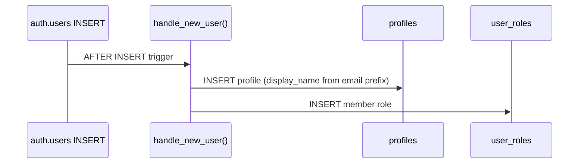

---

## 8. Authentication & authorization

### Auth flow

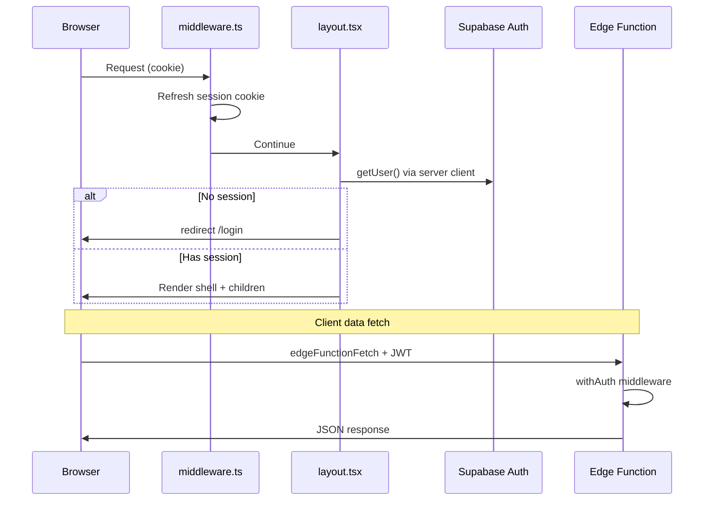

### Roles & permissions (seeded)

| Role slug | Permissions |
|-----------|-------------|
| `member` | (none beyond own profile) |
| `moderator` | `users:read` |
| `admin` | `users:read`, `users:manage`, `flags:read`, `flags:manage`, `audit:read`, `admin:access` |
| `super_admin` | All permissions |

Permissions are strings: `resource:action` (e.g. `flags:manage`).

### Authorization layers

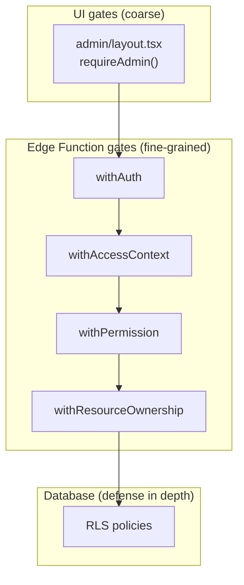

> UI gates redirect non-admins away from `/admin`. **Mutations are still authorized server-side** — never trust the UI alone.

### Local test users

| Email | Password | Roles |
|-------|----------|-------|
| `member@local.test` | `password123` | member |
| `admin@local.test` | `password123` | member, admin |

⚠️ Local/dev only. Never seed these in staging or production.

---

## 9. Event-driven architecture

Domain mutations emit **events**; **Inngest** delivers them to handlers that run side effects asynchronously. The sync request path (Edge Function → Postgres) stays fast; audit logs, search indexing, email, and analytics happen off the hot path.

### Architecture

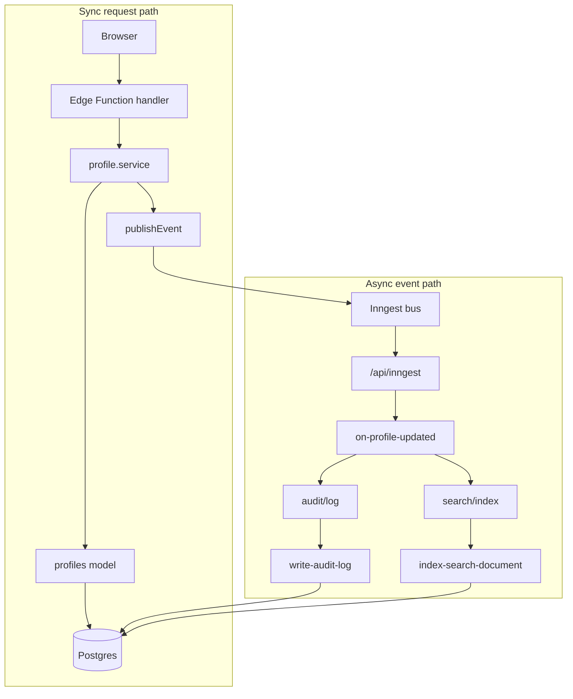

### Event taxonomy

| Kind | Naming | Who emits | Who consumes | Example |
|------|--------|-----------|--------------|---------|
| **Domain events** | `entity/action` | Edge services after a successful write | Orchestrator handlers that fan out | `profile/updated` |
| **Integration commands** | `integration/action` | Orchestrators or providers | Single-purpose workers | `audit/log`, `search/index`, `email/send` |

Domain handlers **orchestrate**; integration handlers **execute**. Services stay decoupled from side effects.

### Publishers

| Runtime | API | Location |
|---------|-----|----------|
| Edge Functions (Deno) | `publishEvent()` | `supabase/functions/_services/events/publisher.ts` |
| Next.js (server) | `events.publish()` | `src/lib/providers/jobs/publisher.ts` |

Both use Inngest when `INNGEST_EVENT_KEY` is set; otherwise they log to console (local dev). **Publish failures never fail the HTTP response** — the DB write already succeeded; Inngest retries consumers.

`jobs.emit()` remains as a backward-compatible alias for `events.publish()`.

### Event catalog

| Event name | Kind | Payload | Handler |
|------------|------|---------|---------|
| `profile/updated` | Domain | profileId, ownerId, displayName, changedFields | `on-profile-updated` |
| `user/created` | Domain | userId, email | `on-user-created` |
| `email/send` | Integration | template, to, payload | `send-email` |
| `audit/log` | Integration | actorId, action, resourceType | `write-audit-log` |
| `search/index` | Integration | entityType, entityId, title | `index-search-document` |
| `cache/invalidate` | Integration | namespace, id | `invalidate-cache` |
| `analytics/track` | Integration | eventName, userId, properties | `track-analytics` |

### Working example: profile updated

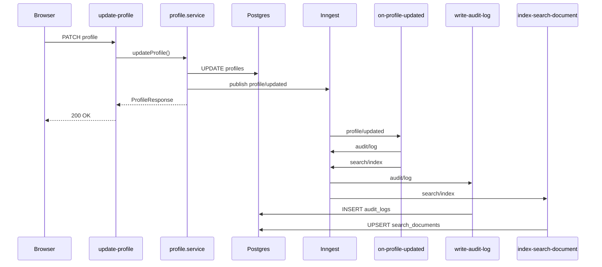

**Emitter** — Edge service after DB write:

```typescript
// supabase/functions/_services/user/profile.service.ts
await publishEvent({
  name: "profile/updated",
  data: { profileId, ownerId, displayName, changedFields },
});
```

**Consumer** — orchestrator fans out to integration handlers:

```typescript
// src/lib/jobs/functions/on-profile-updated.ts
export const onProfileUpdated = inngest.createFunction(
  { id: "on-profile-updated", triggers: [{ event: "profile/updated" }] },
  async ({ event, step }) => {
    await step.run("audit", () => events.publish({ name: "audit/log", data: { ... } }));
    await step.run("search-index", () => events.publish({ name: "search/index", data: { ... } }));
  },
);
```

### Local end-to-end verification

1. `npm run dev:all` + `npx inngest-cli@latest dev` (pointed at `localhost:3000/api/inngest`)
2. Set `INNGEST_EVENT_KEY` in `.env.local` and export for Edge Functions
3. Log in as `member@local.test`, update profile display name
4. Confirm in Supabase Studio: `audit_logs` row (`action = profile.updated`) and `search_documents` row (`entity_type = profile`)

> Application code calls `events.publish()` (or `jobs.emit()`) — never Inngest directly. Swapping providers means changing `src/lib/providers/jobs/publisher.ts` and the Edge publisher only.

---

## 10. Swappable providers

Every third-party service sits behind an interface. Free tier by default; swap = new implementation + one factory branch.

| Provider | Interface location | Default | Fallback (no API key) |
|----------|-------------------|---------|------------------------|
| Email | `src/lib/providers/email.ts` | Resend | Console logger |
| SMS | `src/lib/providers/sms.ts` | — | Console logger |
| Storage | `src/lib/providers/storage.ts` | Supabase Storage | — |
| Search | `src/lib/providers/search.ts` | Postgres full-text | — |
| Analytics | `src/lib/providers/analytics/posthog.ts` | PostHog | No-op |
| Jobs | `src/lib/providers/jobs/client.ts` | Inngest | — |
| Redis | `src/lib/providers/redis/client.ts` | Upstash | Graceful disable |

**Example — email provider factory:**

```typescript
export function getEmailProvider(): EmailProvider {
  if (env.EMAIL_PROVIDER === "resend" && env.RESEND_API_KEY) {
    return new ResendEmailProvider(env.RESEND_API_KEY);
  }
  return new ConsoleEmailProvider();  // logs instead of sending
}
```

---

## 11. Route groups & gating

Route groups organize layouts; **parentheses are not URL segments**.

| Group | URL examples | Layout responsibility |
|-------|-------------|----------------------|
| `(public)` | `/`, `/login`, `/signup` | Minimal chrome; redirect if already signed in |
| `(authenticated)` | `/dashboard`, `/profile` | `requireSession()` + AppShell |
| `(authenticated)/admin/` | `/admin/flags`, `/admin/overview` | Nested `requireAdmin()`; overview requires `requireSuperAdmin()` |
| `(member)` | (stub) | Future member shell |
| `(shared)` | `/help` | Works for any auth state |

### Request lifecycle

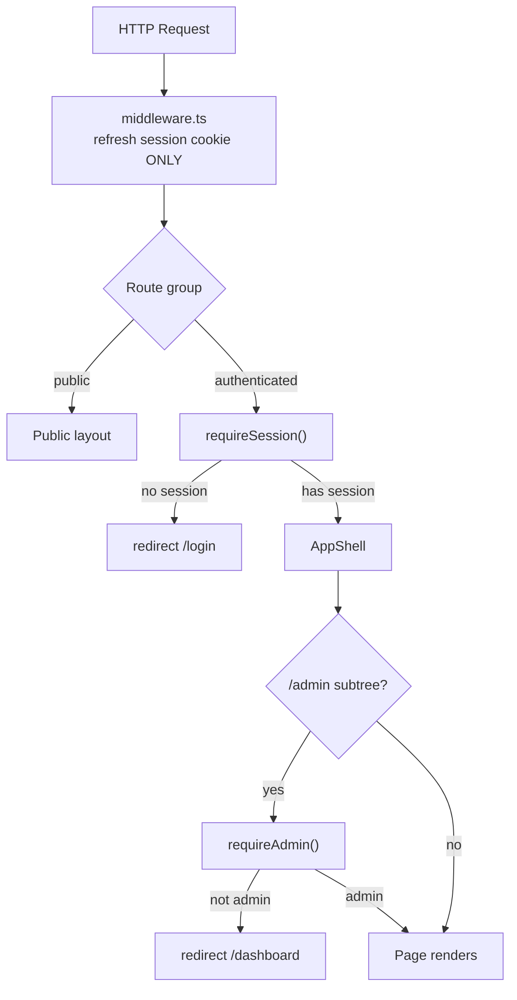

> Auth gating lives in **layouts**, not middleware and not every page.

---

## 12. Error handling

### Error shape (consistent everywhere)

```json
{
  "error": {
    "code": "validation_error",
    "message": "Please check the fields and try again.",
    "details": { "issues": { "displayName": ["Too long"] } }
  }
}
```

### Error codes

| Code | HTTP | User-facing example |
|------|------|---------------------|
| `validation_error` | 400 | "Please check the fields and try again." |
| `unauthorized` | 401 | "Please sign in to continue." |
| `forbidden` | 403 | "You do not have permission to do that." |
| `not_found` | 404 | "We could not find what you were looking for." |
| `rate_limited` | 429 | "You are doing that too quickly." |
| `internal_error` | 500 | "Something went wrong on our end." |

### Rules

- **`userMessage`** → shown to users (plain language, non-technical)
- **`message`** → logs only, never exposed
- Unknown errors collapse to generic `internal_error` (OWASP A10)

### UI error surfaces

| Surface | Location | Purpose |
|---------|----------|---------|
| `ErrorState` | `components/shared/error-state.tsx` | Branded card for query failures and boundaries |
| `not-found.tsx` | `app/not-found.tsx` | Custom 404 |
| `error.tsx` | `app/error.tsx`, `(authenticated)/error.tsx` | Route error boundaries + Sentry |
| `global-error.tsx` | Root fallback | Catastrophic errors outside layout |
| Toasts | `lib/toast/user-message.ts` | Mutation/action feedback via Sonner |
| Modals | `AppModal` + `ModalHost` + `openModal()` | Confirm flows from colocated hooks |

---

## 13. Testing & CI

### Test pyramid

| Layer | Tool | Location | What it covers |
|-------|------|----------|----------------|
| Unit | Vitest | `tests/unit/` | Pure logic (access control eval, feature flags, schemas) |
| Component | Vitest + Testing Library | `tests/components/` | UI components |
| E2E + a11y | Playwright + axe-core | `e2e/` | Auth flows, accessibility |
| Load (smoke) | k6 | `load/smoke.js` | Local stack sanity (~100 VUs) |
| Load (stress) | k6 | `load/stress-same-page.js` | Staging capacity (25k–50k VUs) |

See `load/README.md` for staging stress runs. Rate limiting and infrastructure
limits shape results at scale — load tests inform capacity planning, not infinite
throughput guarantees.

### Example unit test target

```typescript
// tests/unit/access-control-evaluate.test.ts
// Tests pure functions in supabase/functions/_services/access-control/evaluate.ts
hasPermission(["users:read", "flags:manage"], "flags:manage"); // true
hasPermission(["users:read"], "flags:manage");                   // false
```

### CI pipeline (`.github/workflows/ci.yml`)

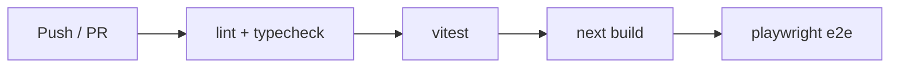

Pre-commit hook (Husky + lint-staged): ESLint fix + Prettier on staged files.

---

## 14. Local development

### First-run checklist

```bash
npm install
cp .env.example .env.local
npm run supabase:start          # copy printed keys into .env.local
npm run db:fresh                # migrations + seed + print test users
npm run dev:local               # Next.js + Edge Functions + Inngest (one terminal)
```

Visit http://localhost:3000.

### Local services

| Service | URL | Notes |
|---------|-----|-------|
| Next.js app | http://localhost:3000 | `npm run dev` |
| Supabase API | http://127.0.0.1:54521 | Custom port in `config.toml` |
| Supabase Studio | http://127.0.0.1:54523 | DB browser |
| Inbucket (email) | http://127.0.0.1:54524 | Catch outbound email locally |
| Email preview | http://localhost:3001 | `npm run email:dev` |

### Environment variables

See `.env.example`. Key groups:

| Group | Required locally? | Notes |
|-------|-------------------|-------|
| `NEXT_PUBLIC_SUPABASE_*` | ✅ Yes | From `supabase start` output |
| `UPSTASH_REDIS_*` | ❌ No | Rate limiting disabled gracefully |
| `RESEND_API_KEY` | ❌ No | Emails logged to console |
| `INNGEST_*` | ❌ No | Jobs work in dev mode |
| `SENTRY_*`, `POSTHOG_*` | ❌ No | Monitoring/analytics disabled |

---

## 15. Deployment

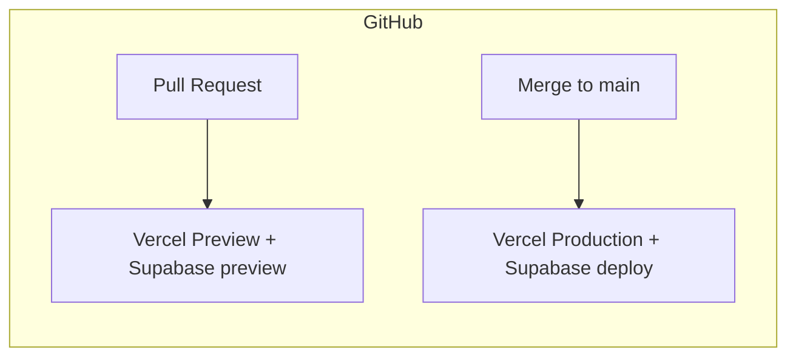

| Target | Trigger | Workflow |
|--------|---------|----------|
| Vercel preview | PR opened | `.github/workflows/deploy.yml` |
| Vercel production | Merge to `main` | Same workflow |
| Edge Functions | Same deploy | Supabase CLI in workflow |

**Required secrets:** `VERCEL_TOKEN`, `VERCEL_ORG_ID`, `VERCEL_PROJECT_ID`, `SUPABASE_ACCESS_TOKEN`, `SUPABASE_PROJECT_ID`.

**Environments:** `local` → `staging` → `production`, separated by env vars. No secrets committed.

---

## 16. What is NOT built yet

These are intentionally deferred. The foundation is designed so each slots in via the [new feature checklist](#17-new-feature-checklist):

- Forums, threads, comments
- Voting / reactions
- Moderation tools
- Memberships / subscriptions / payments
- Video hosting / CMS
- Notifications / DMs
- Communities UI (DB stubs exist)
- Product analytics dashboards

---

## 17. New feature checklist

When adding a feature, work through these steps in order:

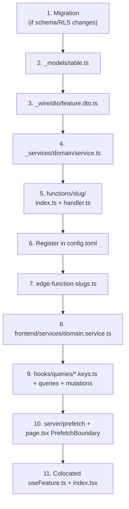

### Naming worked example

Adding "create shipment":

| Step | File / name |
|------|-------------|
| Slug | `create-shipment` |
| Folder | `supabase/functions/create-shipment/` |
| Service (backend) | `_services/shipment/shipment.service.ts` → `createShipment()` |
| Model | `_models/shipments.ts` |
| DTO | `_wire/dto/shipment.dto.ts` |
| Frontend service | `frontend/services/shipment.service.ts` → `createShipment()` |
| Mutation hook | `hooks/mutations/useShipment.ts` → `useCreateShipmentMutation()` |
| Query key | `["shipment", id]` |

---

## Quick reference links

| Resource | Location |
|----------|----------|
| Architecture rules (binding) | `AGENTS.md` + `.cursor/rules/` |
| Setup instructions | `README.md` |
| Edge Function slugs | `src/config/edge-function-slugs.ts` |
| Env template | `.env.example` |
| Seed data | `supabase/seed.sql` |
| Job events | `src/lib/jobs/catalog.ts` |

---

*Questions? Start with `README.md` for setup, then trace a request through the profile update flow above — it touches every layer.*
